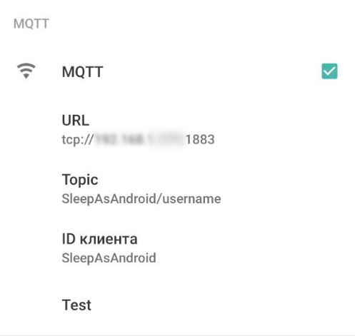

 
[](https://github.com/custom-components/hacs) 
[](https://www.patreon.com/IATkachenko)

# Sleep As Android custom integration

This integration will allow you to get events from your [SleepAsAndroid](https://sleep.urbandroid.org) application in a form of the sensor states and events in Home assistant.

## Installation & configuration
### Requirements
You will need:  
  * configured MQTT server in `configuration.yaml` like
    ```yaml
    mqtt:
      broker: mqtt.myserver
      port: 1883
      username: ha_husr
      discovery: true 
    ```
 * Sleep As android with MQTT support (currently beta version)
    * go to Settings -> Services -> Automatization -> MQTT
    * enable and configure MQTT
    
 * Home Assistant v2021.7

### Installation
 * go to HACS->Integrations->three dots at upper-right conner->Custom repositories
 * add `IATkachenko/HA-SleepAsAndroid` to `ADD CUSTOM REPOSITORY` field and select `Integration` in `CATEGORY`
 * click `add` button
 * find `Sleep As Andorid` integration;
 * click `Install` (Home assistant restart may be required);

### Configuration 
#### Component configuration
 * `Name`: name of the device/sensor and a prefix for the events. Will be used as a default prefix for devices and events.
 * `Root Topic`: MQTT topic where `Sleep as Android` will create subtopic for the event publishing. Every subtopic will be a unique device in `Home Assistant`.
 * `QOS`: quality of service for MQTT 

#### Application configuration
To configure `Sleep As Android` for working with this integration:
 1. Go to application settings
 1. Find **Services** in integration section
 1. Go to **Automation**
 1. Find **MQTT** section
 
 Then:
 * Enable it
 * `URL` is a URL for your MQTT server. It should look like `tpc:///mqtt_user:mqtt_password@mqtt_host:mqtt_port`
 * `Topic` is a topic name where the application will publish events. MUST be a subtopic in **Root topic** from integration settings. Topic name will be used as a suffix for the default device name in HomeAssistant.
   * For example, if your root topic is `SleepAsAndroid`, a valid subtopic would be `SleepAsAndroid/username`.
 * `Client ID` is any ID. It is not used by integration and is not published to MQTT (now).


 
More details in [Wiki](https://github.com/IATkachenko/HA-SleepAsAndroid/wiki/application-configuration).
 
## Usage
`<name>` is an integration name in lower case without spaces from the `Settings` dialog.
List of events is available at [Sleep As Android documentation page](https://docs.sleep.urbandroid.org/services/automation.html#events)

### on device event (recommended)
 1. select `Device` in automatization trigger and use `SleepAsAndroid` device;
 1. select trigger from a list.
 
### on sensor state change
State of sensor `sensor.<name>` will contain the recent event name, that got published by the application.
### on event
If application publishes a new event, then integration fires `<name>` event with payload:
```json
{
  "event": "<event_name_from_application>"
}
```

## Troubleshooting
`configuration.yaml`:
```yaml
logger:
  default: warning
  logs:
    custom_components.sleep_as_android: debug
```
